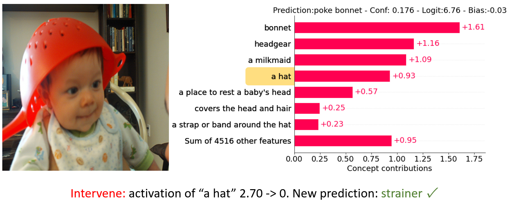

## Abstract

Deep neural networks' black-box nature raises concerns about interpretability in critical applications. While recent Concept Bottleneck Models (CBMs) using Vision-Language Models have improved transparency, they struggle with concept prediction accuracy and faithfulness. We propose an expert-in-the-loop framework with three key innovations:

1. A refined concept generation method with standardized cross-class concepts
2. A novel faithfulness measurement comparing spatial attribution maps with GroundingDINO bounding boxes
3. Fine-tuning concept neurons with saliency loss

Our method significantly improves the model's spatial faithfulness while maintaining comparable accuracy.

* * *

## Background

### Concept Bottleneck Models (CBMs)




Concept Bottleneck Models address lack of transparency in deep neural networks by introducing a concept bottleneck layer (CBL) before the final output layer that captures human-interpretable concepts. Instead of making predictions directly from raw data, the model identifies familiar concepts first—such as "wheels" and "headlights" in an image of a car—and then uses these concepts to reach its final decision. 

This approach:
- Enhances transparency
- Allows non-experts to understand model reasoning
- Fosters greater trust in AI systems

### Recent Advancements and Limitations

Recent research has explored using Vision-Language Models (VLMs) as an alternative to human-created annotations:
- Large Language Models (LLMs) generate concept sets
- Vision-Language Models annotate datasets with concept activations

Despite progress, these approaches face limitations:
- Inaccurate concept prediction
- Models frequently misidentify concepts
- Automatic Concept Correction may cause concept neurons to fit to class rather than concept
- Lowered faithfulness and interpretability

* * *

## FaithfulCBM

Our proposed framework addresses the limitations of previous works with three key innovations:

### 1. Concept Set Refinement

Previous methods generated concepts by prompting LLMs to "list the most important features for recognizing something as a {class}." We identified several issues with this approach:

- Non-visual concepts were incorrectly included (e.g., "fast, erratic flight patterns")
- Concept lists were not comprehensive enough
- Semantically identical concepts had inconsistent wording across classes

Our solution:
- For CUB200, we developed an automatic attribute framework with 22 bird attributes (head color, pattern, bill color, etc.)
- Used few-shot learning to guide GPT-4 toward desired concept types
- For critical applications, expert knowledge can refine LLM-generated concepts

### 2. Faithfulness Measurement

We measure faithfulness with attribution map and GroundingDINO bounding boxes alignment:

1. For a concept neuron, find top k activating images
2. Use GroundingDINO to annotate images with the target concept
3. Use attribution methods like GradCAM to obtain saliency maps

We compute three key statistics:
- IoU: Intersection over Union score between bounding box and area with top 30% saliency
- Saliency ratio: Average saliency inside bounding box vs. outside
- % Saliency captured: Sum of saliency inside bounding box as percentage of total

### 3. Fine-tuning with Saliency Loss

In addition to Binary Cross Entropy (BCE) loss for multi-label prediction, we defined a saliency loss to ensure concept neurons focus on correct image regions:

```
L_sal = RELU(saliency outside bboxes - saliency inside bboxes + 0.5)
```

This loss helps concept neurons pay attention to the intended visual features rather than fitting to class-specific patterns.

* * *

## Experiments

We conducted experiments on the CUB200 and Places365 datasets to evaluate our framework.

### Concept Set Refinement Results

When comparing overall metrics between original and refined concept sets for mutual concepts, faithfulness improved:

| Metric | Original concepts | Refined concepts |
|--------|-------------------|------------------|
| IoU | 0.204 | 0.207 |
| Saliency ratio | 1.185 | 1.235 |
| % Saliency capture | 0.232 | 0.254 |

We discovered a correlation between the number of training images and concept faithfulness. In the refined concept set, each concept was trained with 144 images on average (compared to 60 in the original set).

### Fine-tuning Results

Fine-tuning with saliency loss produced promising results:

| Model | Saliency ratio | Acc @NEC=5 | Training time |
|-------|----------------|------------|---------------|
| CUB fine-tune "black head" | 1.599 (from 1.252) | 0.7503 (from 0.7504) | 16 min |
| CUB fine-tune all | 1.2629 (from 1.217) | 0.7333 (from 0.7504) | 200 min |
| Places365 finetune "roof" | 3.102 (from 1.219) | Similar to original | 2h per epoch |

Visual examples show significant improvements:
- "Roof" concept: IoU improved from 0.111 to 0.580, saliency ratio from 0.600 to 2.866
- "Long Pointed Wings": IoU from 0.294 to 0.368, saliency ratio from 1.115 to 1.467
- "Black Head": IoU from 0.150 to 0.176, saliency ratio from 1.372 to 1.769

### Key Observations

- The refined concept set made per-class concepts more comprehensive
- After refinement, concept neurons (e.g., "brown wings") activated for the actual feature across multiple classes instead of fitting to a single class
- GroundingDINO works well but occasionally has glitches (e.g., misidentifying objects)
- Fine-tuning causes a slight drop in prediction accuracy, as some original concepts were directly fitting to class rather than the actual feature

* * *

## Conclusion

We have presented a framework for enhancing CBM faithfulness through three key innovations:

1. Refined concept generation with standardized cross-class concepts
2. A novel faithfulness measurement using attribution maps with GroundingDINO bounding boxes
3. Fine-tuning with saliency loss

Our experiments on CUB200 and Places365 datasets demonstrate improved concept detection faithfulness while maintaining reasonable classification performance. These advancements make CBMs more trustworthy for critical applications where understanding model reasoning is essential, paving the way for AI systems that are both powerful and transparently interpretable.

Future work could:
- Improve GroundingDINO's effectiveness by rephrasing complex concepts
- Adopt more powerful object grounding models
- Optimize the fine-tuning pipeline to reduce computational costs for large-scale datasets


